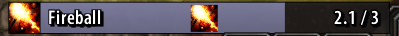

### Nampower settings
See https://gitea.com/avitasia/nampower or in game tooltip for description of each setting.
Access settings in game by right clicking the minimap icon.

### Per Character settings
You can now use different nampower settings for each character.  When you enable this option it will save all of your current nampower settings into 
WTF\Account\YOUR_ACCOUNT\Nordanaar\YOUR_CHARACTER\SavedVariables\NampowerSettings.lua.  Then every time the game loads the settings in that file will overwrite both the nampower defaults and whatever cvars were saved in your main Config.wtf.  If you make changes to any settings while this option is enabled it will save to that character's settings file AS WELL AS the main Config.wtf.

#### Queued spell icon display
If you have superwow there is an option (default off) to display an icon for the most recently queued spell (the mini fireball in the castbar).  You can resize and position it anywhere.

